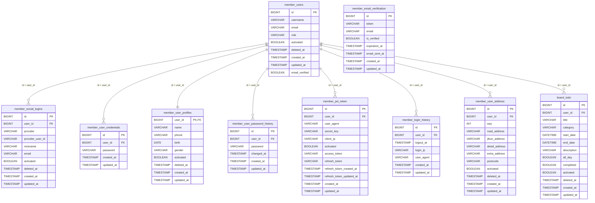

# JWT 기반 TODO 백엔드 API 구현 과제

## 목차

- [JWT 기반 TODO 백엔드 API 구현 과제](#jwt-기반-todo-백엔드-api-구현-과제)
  - [목차](#목차)
  - [deploy](#deploy)
  - [api 상세 명세](#api-상세-명세)
    - [Global exception handler](#global-exception-handler)
    - [Custom runtime exception](#custom-runtime-exception)
    - [Global exception CODE](#global-exception-code)
    - [공통 api wapper](#공통-api-wapper)
    - [AuthController](#authcontroller)
      - [기본 정보](#기본-정보)
      - [API 목록](#api-목록)
        - [액세스 토큰 갱신](#액세스-토큰-갱신)
        - [소셜 로그인 URL 조회](#소셜-로그인-url-조회)
        - [소셜 로그아웃 URL 조회](#소셜-로그아웃-url-조회)
      - [데이터 모델](#데이터-모델)
        - [RefreshTokenRequest](#refreshtokenrequest)
        - [JwtTokenResponse](#jwttokenresponse)
        - [CommonApiResponse](#commonapiresponse)
      - [에러 코드](#에러-코드)
    - [TodoController](#todocontroller)
    - [Todo 관리 API 명세서](#todo-관리-api-명세서)
      - [기본 정보](#기본-정보-1)
      - [API 목록](#api-목록-1)
  - [1. Todo 생성 🔐](#1-todo-생성-)
      - [2. 전체 Todo 조회 🔐](#2-전체-todo-조회-)
      - [3. 단일 Todo 조회 🔐](#3-단일-todo-조회-)
      - [4. Todo 수정 🔐](#4-todo-수정-)
      - [5. Todo 삭제 🔐](#5-todo-삭제-)
      - [6. Todo 검색 🔐](#6-todo-검색-)
      - [데이터 모델](#데이터-모델-1)
      - [TodoRequest](#todorequest)
      - [TodoSearchRequest](#todosearchrequest)
      - [주의 사항](#주의-사항)
    - [User API 명세서](#user-api-명세서)
      - [기본 정보](#기본-정보-2)
      - [API 목록](#api-목록-2)
        - [1. 회원 목록 조회](#1-회원-목록-조회)
        - [2. 회원가입](#2-회원가입)
        - [3. 로그인](#3-로그인)
        - [4. 로그아웃](#4-로그아웃)
        - [5. 내 정보 조회](#5-내-정보-조회)
        - [6. 내 정보 수정](#6-내-정보-수정)
        - [7. 회원 탈퇴](#7-회원-탈퇴)
        - [8. 내 주소 전체 조회](#8-내-주소-전체-조회)
      - [데이터 모델](#데이터-모델-2)
        - [UserResponse](#userresponse)
        - [LoginSuccessResponse](#loginsuccessresponse)
        - [MemberResponse](#memberresponse)
        - [UserAddressResponse](#useraddressresponse)
      - [에러 코드 예시](#에러-코드-예시)
      - [참고](#참고)
    - [유효성 검증 API 명세서](#유효성-검증-api-명세서)
      - [기본 정보](#기본-정보-3)
      - [API 목록](#api-목록-3)
        - [1. 이메일 인증 코드 발송](#1-이메일-인증-코드-발송)
        - [2. 이메일 인증 코드 확인](#2-이메일-인증-코드-확인)
        - [3. 아이디 중복 확인](#3-아이디-중복-확인)
      - [데이터 모델](#데이터-모델-3)
        - [EmailVerificationRequest](#emailverificationrequest)
      - [에러 코드 예시](#에러-코드-예시-1)
      - [사용 시나리오 예시](#사용-시나리오-예시)
    - [Table schema relation](#table-schema-relation)

---
Perplexity로부터의 답변: pplx.ai/share
## deploy

- frontend : react, typescript

- backend : spring boot3, java17

## api 상세 명세

### Global exception handler

```java
@Slf4j
@ControllerAdvice
public class GlobalResponseExceptionHandler extends ResponseEntityExceptionHandler {

    // CustomRuntimeException 처리
    @ExceptionHandler(CustomRuntimeException.class)
    public ResponseEntity<CommonApiResponse<?>> handleCustomRuntimeException(CustomRuntimeException ex) {
        return ResponseEntity.status(ex.getErrorCode().getStatus()).body(
                CommonApiResponse.error(
                        ex.getErrorCode().getStatus(),
                        ex.getErrorCode().getCode(),
                        ex.getMessage()
                )
        );
    }
}
```

### Custom runtime exception

```java
@Slf4j
@Getter
public class CustomRuntimeException extends RuntimeException {

    private final ErrorCode errorCode;
    private final String details;  // 예외에 대한 추가적인 설명

    // 기본 생성자
    public CustomRuntimeException(ErrorCode errorCode) {
        super(errorCode.getMessage()); // 기본 메시지 설정
        this.errorCode = errorCode;
        this.details = null; // 디테일이 없으면 null
        logError();
    }

    // 메시지 + 디테일을 포함하는 생성자
    public CustomRuntimeException(ErrorCode errorCode, String details) {
        super(errorCode.getMessage() + ": " + details); // 메시지 + 디테일
        this.errorCode = errorCode;
        this.details = details;
        logError();
    }

    // 로그를 출력하는 메서드
    private void logError() {
        String message = details == null ? errorCode.getMessage() : errorCode.getMessage() + ": " + details;
        switch (errorCode.getLogLevel()) {
            case WARN -> log.warn(message);
            case ERROR -> log.error(message);
            case DEBUG -> log.debug(message);
            default -> log.info(message);
        }
    }
}
```

### Global exception CODE

```java
@Slf4j
@Getter
@AllArgsConstructor
public enum ErrorCode {

    ALREADY_LOGOUT(HttpStatus.NOT_FOUND, "AUTH_001", "이미 로그아웃 되었습니다", LogLevel.WARN),
    NOT_FOUND_TOKEN(HttpStatus.NOT_FOUND, "AUTH_011", "해당 토큰정보가 없습니다.", LogLevel.WARN),
    NOT_FOUND_OAUTH_PROVIDER(HttpStatus.NOT_FOUND, "AUTH_010", "해당 SOCIAL LOGIN 이 존재하지 않습니다.", LogLevel.ERROR),
    NOT_FOUND_USER(HttpStatus.NOT_FOUND, "AUTH_012", "해당 사용자가 없습니다.", LogLevel.WARN),
    NOT_FOUND_USER_PROFILE(HttpStatus.NOT_FOUND, "AUTH_013", "해당 사용자 상세 정보가 없습니다.", LogLevel.WARN),
    NOT_FOUND_CREDENTIALS(HttpStatus.NOT_FOUND, "AUTH_014", "해당 패스워드가 없습니다.", LogLevel.WARN),
    NOT_FOUND_EMAIL_VERIFICATION(HttpStatus.NOT_FOUND, "AUTH_015", "해당 이메일 인증이 없습니다.", LogLevel.WARN),

    ALREADY_EXIST_EMAIL(HttpStatus.CONFLICT, "AUTH_021", "이미 존재하는 메일입니다.", LogLevel.WARN),
    INVALID_USER_ID(HttpStatus.BAD_REQUEST, "AUTH_031", "유효하지 않은 사용자 아이디", LogLevel.WARN),
    INVALID_PASSWORD(HttpStatus.BAD_REQUEST, "AUTH_032", "유효하지 않은 패스워드", LogLevel.WARN),  // 인증 헤더가 잘못된 경우
    INVALID_ACCESS_TOKEN(HttpStatus.UNAUTHORIZED, "AUTH_033", "유효하지 않거나 만료된 액세스 토큰", LogLevel.ERROR),  // 잘못된 액세스 토큰
    MISSING_ACCESS_TOKEN(HttpStatus.UNAUTHORIZED, "AUTH_034", "액세스 토큰이 누락되었습니다.", LogLevel.ERROR),  // 액세스 토큰 누락
    UNAUTHORIZED_ACCESS(HttpStatus.UNAUTHORIZED, "AUTH_041", "허가되지 않은 접근", LogLevel.WARN),
    FAILED_EMAIL_SEND(HttpStatus.SERVICE_UNAVAILABLE, "FAIL_001", "Email 전송 실패", LogLevel.WARN),

    NOT_FOUND_TODO(HttpStatus.NOT_FOUND, "TODO_001", "해당 TODO 가 없습니다.", LogLevel.ERROR);


    private final HttpStatus status;  // HTTP 상태 코드 추가
    private final String code;
    private final String message;
    private final LogLevel logLevel;

}
```

### 공통 api wapper

```java
@Getter
@Builder
@NoArgsConstructor
@AllArgsConstructor
@Schema(description = "공통 API 응답 구조<br />Error/반환 값이 있는 응답의 경우 참고")
public class CommonApiResponse<T> {

    @Schema(description = "응답 시간", example = "2025-02-04T15:30:00")
    private LocalDateTime timestamp;

    @JsonIgnore
    @Schema(description = "HTTP 상태 코드", example = "200")
    private int status;

    @Schema(description = "에러 코드", example = "RESOURCE_NOT_FOUND")
    private String code;

    @Schema(description = "응답 메시지", example = "Success")
    private String message;

    @Schema(description = "상세 오류 정보 (개발용)")
    private String details;

    @Schema(description = "응답 데이터")
    private T data;

    // success
    public static <T> CommonApiResponse<T> success(T data) {
        return CommonApiResponse.<T>builder()
                .timestamp(CustomLocalDateTimeUtils.getNow())
                .data(data)
                .build();
    }

    // Error
    public static <T> CommonApiResponse<T> error(
            HttpStatus status,
            String errorCode,
            String message
    ) {
        return CommonApiResponse.<T>builder()
                .timestamp(CustomLocalDateTimeUtils.getNow())
                .status(status.value())
                .code(errorCode)
                .message(message)
                .build();
    }
}

```

### AuthController

- JWT 인증 API 명세서

인증 관련 기능을 제공하는 API 명세서입니다. 소셜 로그인 및 토큰 관리 기능을 포함하고 있습니다.

#### 기본 정보

- 기본 경로: `/api/auth`
- 응답 형식: `CommonApiResponse` 형식으로 통일

#### API 목록

##### 액세스 토큰 갱신

Refresh Token을 사용하여 새로운 Access Token을 발급합니다.

- **URL**: `/api/auth/reissue`
- **Method**: `POST`
- **Headers**:
    - `User-Agent`: 사용자 에이전트 정보
- **Request Body**:
    
    ```json
    {
      "refreshToken": "string"
    }
    
    ```
    
- **Response**:
    
    ```json
    {
      "code": "string",
      "message": "string",
      "data": {
        "accessToken": "string",
        "refreshToken": "string",
        "expiresIn": "number"
      }
    }
    
    ```
    
- **에러 응답**:
    - 유효하지 않은 Refresh Token
    - 만료된 Refresh Token

##### 소셜 로그인 URL 조회

지정된 소셜 제공자의 로그인 URL을 반환합니다.

- **URL**: `/api/auth/provider/login/{provider}`
- **Method**: `POST`
- **Path Variables**:
    - `provider`: 소셜 로그인 제공자 (kakao, naver)
- **Response**:
    
    ```json
    {
      "code": "string",
      "message": "string",
      "data": "소셜 로그인 URL"
    }
    
    ```
    
- **에러 응답**:
    - 지원하지 않는 소셜 제공자 요청 시 `NOT_FOUND_OAUTH_PROVIDER` 에러 발생

##### 소셜 로그아웃 URL 조회

지정된 소셜 제공자의 로그아웃 URL을 반환합니다.

- **URL**: `/api/auth/provider/logout/{provider}`
- **Method**: `POST`
- **Path Variables**:
    - `provider`: 소셜 로그인 제공자 (kakao, naver)
- **Response**:
    
    ```json
    {
      "code": "string",
      "message": "string",
      "data": "소셜 로그아웃 URL"
    }
    
    ```
    
- **에러 응답**:
    - 지원하지 않는 소셜 제공자 요청 시 `NOT_FOUND_OAUTH_PROVIDER` 에러 발생

#### 데이터 모델

##### RefreshTokenRequest

```json
{
  "refreshToken": "string" // 갱신에 사용할 Refresh Token
}

```

##### JwtTokenResponse

```json
{
  "accessToken": "string", // 새로 발급된 Access Token
  "refreshToken": "string", // 새로 발급된 Refresh Token(갱신된 경우)
  "expiresIn": "number" // Access Token 만료 시간(초)
}

```

##### CommonApiResponse

```json
{
  "code": "string", // 응답 코드
  "message": "string", // 응답 메시지
  "data": "T" // 응답 데이터, 제네릭 타입
}

```

#### 에러 코드

| 코드 | 설명 |
| --- | --- |
| NOT_FOUND_OAUTH_PROVIDER | 요청된 OAuth 제공자를 찾을 수 없음 |

### TodoController

### Todo 관리 API 명세서

일정 관리를 위한 Todo 관련 API 명세서입니다. 모든 API는 인증이 필요합니다.

#### 기본 정보

- **기본 경로**: `/todos`
- **응답 형식**: `CommonApiResponse<T>`
- **필수 헤더**: `Authorization` 🔐

#### API 목록

## 1. Todo 생성 🔐

**새로운 Todo 항목을 생성합니다.**

- **URL**: `/todos`
- **Method**: `POST`
- **Request Body**:
    
    ```json
    {
      "title": "회의 준비",
      "category": "업무",
      "startDate": "2025-05-20T10:00:00",
      "endDate": "2025-05-20T12:00:00",
      "description": "회의실 3층",
      "allDay": false,
      "completed": false
    }
    ```
    
- **Response**:
    
    ```json
    {
      "code": "string",
      "message": "string",
      "data": {
        "id": 1,
        "title": "회의 준비",
        "category": "업무",
        "startDate": "2025-05-20T10:00:00",
        "endDate": "2025-05-20T12:00:00",
        "description": "회의실 3층",
        "allDay": false,
        "completed": false
      }
    }
    ```
    

#### 2. 전체 Todo 조회 🔐

**모든 Todo 항목을 조회합니다.**

- **URL**: `/todos`
- **Method**: `GET`
- **Response**:
    
    ```json
    {
      "code": "string",
      "message": "string",
      "data": [
        {
          "id": 1,
          "title": "회의 준비",
          "category": "업무",
          "startDate": "2025-05-20T10:00:00",
          "endDate": "2025-05-20T12:00:00",
          "completed": false
        }
      ]
    }
    ```
    

#### 3. 단일 Todo 조회 🔐

**특정 ID의 Todo 항목을 조회합니다.**

- **URL**: `/todos/{id}`
- **Method**: `GET`
- **Path Variable**:
    - `id`: Todo ID (숫자)
- **Response**: TodoResponse 객체 반환

#### 4. Todo 수정 🔐

**기존 Todo 항목을 수정합니다.**

- **URL**: `/todos/{id}`
- **Method**: `PUT`
- **Path Variable**:
    - `id`: 수정할 Todo ID
- **Request Body**: TodoRequest 형식과 동일

#### 5. Todo 삭제 🔐

**특정 Todo 항목을 삭제합니다.**

- **URL**: `/todos/{id}`
- **Method**: `DELETE`
- **Response**: 204 No Content

#### 6. Todo 검색 🔐

**다양한 조건으로 Todo를 검색합니다.**

- **URL**: `/todos/search`
- **Method**: `GET`
- **Query Parameters**:
    
    ```jsx
    /todos/search?page=0&size=10&sort=startDate&direction=desc
    &keyword=회의&category=업무&completed=false
    &startFrom=2025-05-20T09:30&startTo=2025-05-20T18:00
    ```
    
- **Response**:
    
    ```json
    {
      "code": "string",
      "message": "string",
      "data": {
        "todos": [TodoResponse],
        "currentPage": 0,
        "size": 10,
        "totalElements": 50,
        "totalPages": 5
      }
    }
    ```
    

#### 데이터 모델

#### TodoRequest

| 필드 | 타입 | 설명 | 필수 |
| --- | --- | --- | --- |
| title | String | 할 일 제목 | ✔ |
| category | String | 카테고리 |  |
| startDate | LocalDateTime | 시작 일시 |  |
| endDate | LocalDateTime | 종료 일시 |  |
| description | String | 상세 설명 |  |
| allDay | boolean | 종일 여부 |  |
| completed | boolean | 완료 상태 |  |

#### TodoSearchRequest

| 필드 | 타입 | 설명 |
| --- | --- | --- |
| keyword | String | 제목/설명 검색어 |
| category | String | 카테고리 필터 |
| completed | Boolean | 완료 여부 필터 |
| startFrom | LocalDateTime | 시작일 범위 시작 |
| startTo | LocalDateTime | 시작일 범위 종료 |
| endFrom | LocalDateTime | 종료일 범위 시작 |
| endTo | LocalDateTime | 종료일 범위 종료 |
| allDay | Boolean | 종일 이벤트 필터 |
| activated | Boolean | 활성화 여부 필터 |

#### 주의 사항

1. 모든 날짜 형식: `YYYY-MM-DDTHH:mm:ss`
2. 정렬 방향(direction)은 `asc`/`desc`만 허용
3. 페이지 번호(page)는 0부터 시작

### User API 명세서

회원(User) 관련 REST API 명세서입니다.
회원 목록 조회, 회원가입, 로그인/로그아웃, 회원 정보 조회/수정/탈퇴, 주소 조회 기능을 제공합니다.

---

#### 기본 정보

- **Base URL**: `/users`
- **응답 형식**: `CommonApiResponse<T>`

---

#### API 목록

##### 1. 회원 목록 조회

- **URL**: `/users/list`
- **Method**: `GET`
- **설명**: 전체 회원 목록을 조회합니다.
- **응답 예시**:

```json
{
  "code": "SUCCESS",
  "message": "회원 목록 조회 성공",
  "data": [
    {
      "id": 1,
      "username": "naru",
      "email": "naru@naru.com",
      "role": "USER",
      "emailVerified": true,
      "createdAt": "2024-05-14T12:00:00",
      "updatedAt": "2024-05-14T12:00:00",
      "lastLoginAt": "2024-05-14T12:00:00",
      "deletedAt": null,
      "activated": true
    }
  ]
}
```

---

##### 2. 회원가입

- **URL**: `/users/signup`
- **Method**: `POST`
- **설명**: 신규 회원을 등록합니다.
- **Request Body**:

```json
{
  "username": "naru",
  "email": "naru@naru.com",
  "role": "USER",
  "name": "나루",
  "phone": "01012345678",
  "birth": "1990-01-01",
  "address": {
    // UserAddressRequest 필드
  },
  "emailVerified": false,
  "password": "123"
}
```

- **응답 예시**:

```json
{
  "code": "SUCCESS",
  "message": "회원가입 성공",
  "data": {
    "id": 1,
    "username": "naru",
    "email": "naru@naru.com",
    "role": "USER",
    "emailVerified": false,
    "createdAt": "2024-05-14T12:00:00",
    "updatedAt": "2024-05-14T12:00:00",
    "lastLoginAt": null,
    "deletedAt": null,
    "activated": true
  }
}
```

---

##### 3. 로그인

- **URL**: `/users/login`
- **Method**: `POST`
- **설명**: 회원 로그인을 처리합니다.
- **Request Body**:

```json
{
  "username": "naru",
  "password": "123"
}
```

- **응답 예시**:

```json
{
  "code": "SUCCESS",
  "message": "로그인 성공",
  "data": {
    "accessToken": "jwt-access-token",
    "refreshToken": "jwt-refresh-token",
    "user": {
      "id": 1,
      "username": "naru",
      "email": "naru@naru.com",
      "role": "USER",
      "emailVerified": true,
      "createdAt": "2024-05-14T12:00:00",
      "updatedAt": "2024-05-14T12:00:00",
      "lastLoginAt": "2024-05-14T12:00:00",
      "deletedAt": null,
      "activated": true
    }
  }
}
```

---

##### 4. 로그아웃

- **URL**: `/users/logout`
- **Method**: `POST`
- **설명**: 회원 로그아웃을 처리합니다.
- **Headers**:
    - `Authorization`: Bearer {accessToken}
- **응답**:
    - HTTP Status: `204 No Content`
    - Body: 없음

---

##### 5. 내 정보 조회

- **URL**: `/users/me`
- **Method**: `GET`
- **설명**: 현재 로그인한 회원의 정보를 조회합니다.
- **Headers**:
    - `Authorization`: Bearer {accessToken}
- **응답 예시**:

```json
{
  "code": "SUCCESS",
  "message": "회원 정보 조회 성공",
  "data": {
    "user": {
      "id": 1,
      "username": "naru",
      "email": "naru@naru.com",
      "role": "USER",
      "emailVerified": true,
      "createdAt": "2024-05-14T12:00:00",
      "updatedAt": "2024-05-14T12:00:00",
      "lastLoginAt": "2024-05-14T12:00:00",
      "deletedAt": null,
      "activated": true
    },
    "profile": {
      "name": "나루",
      "phone": "01012345678",
      "birth": "1990-01-01",
      "activated": true
    },
    "address": {
      "seq": 1,
      "roadAddress": "서울특별시 강남구 테헤란로 123",
      "jibunAddress": "서울특별시 강남구 역삼동 123-45",
      "detailAddress": "101동 202호",
      "extraAddress": "역삼푸르지오아파트",
      "zipcode": "06134"
    }
  }
}
```

---

##### 6. 내 정보 수정

- **URL**: `/users/me`
- **Method**: `PUT`
- **설명**: 현재 로그인한 회원의 정보를 수정합니다.
- **Headers**:
    - `Authorization`: Bearer {accessToken}
- **Request Body**:

```json
{
  "username": "naru",
  "email": "naru@naru.com",
  "name": "나루",
  "phone": "01012345678",
  "birth": "1990-01-01",
  "address": {
    // UserAddressRequest 필드
  },
  "emailVerified": false
}
```

- **응답 예시**:

```json
{
  "code": "SUCCESS",
  "message": "회원 정보 수정 성공",
  "data": {
    "user": { ... },
    "profile": { ... },
    "address": { ... }
  }
}
```

---

##### 7. 회원 탈퇴

- **URL**: `/users/me`
- **Method**: `DELETE`
- **설명**: 현재 로그인한 회원을 탈퇴(삭제)합니다.
- **Headers**:
    - `Authorization`: Bearer {accessToken}
- **응답**:
    - HTTP Status: `204 No Content`
    - Body: 없음

---

##### 8. 내 주소 전체 조회

- **URL**: `/users/address/user`
- **Method**: `POST`
- **설명**: 로그인한 회원의 모든 주소를 조회합니다.
- **Headers**:
    - `Authorization`: Bearer {accessToken}
- **응답 예시**:

```json
{
  "code": "SUCCESS",
  "message": "주소 목록 조회 성공",
  "data": [
    {
      "seq": 1,
      "roadAddress": "서울특별시 강남구 테헤란로 123",
      "jibunAddress": "서울특별시 강남구 역삼동 123-45",
      "detailAddress": "101동 202호",
      "extraAddress": "역삼푸르지오아파트",
      "zipcode": "06134"
    }
  ]
}
```

---

#### 데이터 모델

##### UserResponse

| 필드 | 타입 | 설명 |
| --- | --- | --- |
| id | Long | 회원 고유번호 |
| username | String | 유저명 |
| email | String | 이메일 |
| role | String | 회원 역할 |
| emailVerified | Boolean | 이메일 인증 여부 |
| createdAt | LocalDateTime | 생성일시 |
| updatedAt | LocalDateTime | 수정일시 |
| lastLoginAt | LocalDateTime | 마지막 로그인 일시 |
| deletedAt | LocalDateTime | 탈퇴일시 |
| activated | Boolean | 활성화 여부 |

##### LoginSuccessResponse

| 필드 | 타입 | 설명 |
| --- | --- | --- |
| accessToken | String | JWT 액세스 토큰 |
| refreshToken | String | JWT 리프레시 토큰 |
| user | UserSimpleResponse | 간략 회원 정보 |

##### MemberResponse

| 필드 | 타입 | 설명 |
| --- | --- | --- |
| user | UserSimpleResponse | 회원 정보 |
| profile | UserProfileResponse | 프로필 정보 |
| address | UserAddressResponse | 주소 정보 |

##### UserAddressResponse

| 필드 | 타입 | 설명 |
| --- | --- | --- |
| seq | Integer | 주소 순번 |
| roadAddress | String | 도로명 주소 |
| jibunAddress | String | 지번 주소 |
| detailAddress | String | 상세 주소 |
| extraAddress | String | 추가 주소 정보 |
| zipcode | String | 우편번호 |

---

#### 에러 코드 예시

| 코드 | 설명 |
| --- | --- |
| USER_NOT_FOUND | 사용자를 찾을 수 없음 |
| INVALID_PASSWORD | 비밀번호 불일치 |
| EMAIL_DUPLICATED | 이메일 중복 |
| … | … |

---

#### 참고

- 모든 API 응답은 `CommonApiResponse<T>` 형태로 반환됩니다.
- 인증이 필요한 API는 `Authorization` 헤더에 JWT AccessToken을 포함해야 합니다.
- 주소 관련 상세 필드는 `UserAddressRequest`/`UserAddressResponse`를 참고하세요.

---

### 유효성 검증 API 명세서

이메일/아이디 중복 확인 및 인증 기능을 제공하는 API 명세서입니다.

---

#### 기본 정보

- **Base URL**: `/api/valid`
- **응답 형식**: `CommonApiResponse<T>`

---

#### API 목록

##### 1. 이메일 인증 코드 발송

- **URL**: `/api/valid/email/send`
- **Method**: `POST`
- **Parameters**:
    - `email`: 인증할 이메일 주소 (쿼리 파라미터)
- **응답 예시**:

```json
{
  "code": "SUCCESS",
  "message": "인증 코드 발송 성공",
  "data": "naru@naru.com로 인증 코드가 발송되었습니다"
}
```

- **에러 케이스**:
    - 유효하지 않은 이메일 형식
    - 이미 가입된 이메일

---

##### 2. 이메일 인증 코드 확인

- **URL**: `/api/valid/email/check`
- **Method**: `POST`
- **Request Body**:

```json
{
  "email": "naru@naru.com",
  "code": "A123E"
}
```

- **응답 예시**:

```json
{
  "code": "SUCCESS",
  "message": "이메일 인증 성공",
  "data": true
}
```

- **에러 케이스**:
    - 잘못된 인증 코드
    - 만료된 인증 코드
    - 존재하지 않는 이메일

---

##### 3. 아이디 중복 확인

- **URL**: `/api/valid/username`
- **Method**: `POST`
- **Parameters**:
    - `username`: 확인할 아이디 (쿼리 파라미터)
- **응답 예시**:

```json
{
  "code": "SUCCESS",
  "message": "사용 가능한 아이디입니다",
  "data": false
}
```

- **응답 해석**:
    - `data: true`: 이미 존재하는 아이디
    - `data: false`: 사용 가능한 아이디

---

#### 데이터 모델

##### EmailVerificationRequest

| 필드 | 타입 | 설명 | 예시 |
| --- | --- | --- | --- |
| email | String | 인증할 이메일 주소 | naru@naru.com |
| code | String | 인증 코드 (6자리) | A123E |

---

#### 에러 코드 예시

| 코드 | 설명 |
| --- | --- |
| INVALID_EMAIL_FORMAT | 잘못된 이메일 형식 |
| EXPIRED_VERIFICATION_CODE | 만료된 인증 코드 |
| INVALID_VERIFICATION_CODE | 잘못된 인증 코드 |
| USERNAME_ALREADY_EXISTS | 이미 존재하는 아이디 |

---

#### 사용 시나리오 예시

1. **회원가입 전 아이디 확인**

```
POST /api/valid/username?username=naru
응답: {"data": false} → 사용 가능
```

1. **이메일 인증 요청**

```
POST /api/valid/email/send?email=naru@naru.com
응답: 인증 코드 발송
```

1. **인증 코드 확인**

```
POST /api/valid/email/check
Body: {"email":"naru@naru.com","code":"A123E"}
응답: {"data": true} → 인증 성공
```

---

### Table schema relation

