# Dockerfile Environment

> **TOC**

- [Dockerfile Environment](#dockerfile-environment)
  - [System banner](#system-banner)
  - [registry service - app.service](#registry-service---appservice)
  - [aws correto setup](#aws-correto-setup)
  - [aws - 80 port setup](#aws---80-port-setup)
  - [.bashrc](#bashrc)
  - [truncate_log.sh](#truncate_logsh)

> ## Structure of Directory

```mermaid
graph LR

    %% ───────────────────────────────
    %% Legend (범례)
    %% ───────────────────────────────
    subgraph Legend["📁 Legend"]
        direction LR
        legend_home["🔵 사용자 홈 디렉토리 (~)"]
        legend_etc["🟠 시스템 설정 디렉토리 (/etc)"]
    end

    %% ───────────────────────────────
    %% 사용자 홈 (~)
    %% ───────────────────────────────
    subgraph Home["🔵 ~ (Home directory)"]
        direction LR
        home["~"]
        bashrc[".bashrc"]
        home --> bashrc

        app_home["~/app"]
        home --> app_home

        app_jar["app.jar"]
        app_home --> app_jar

        log_dir["log"]
        app_home --> log_dir

        log_file["app.log"]
        log_dir --> log_file

        truncate_sh["truncate_log.sh"]
        log_dir --> truncate_sh

        truncate_log["truncate_log.log"]
        log_dir --> truncate_log

        backup_dir["backup"]
        log_dir --> backup_dir

        backup_file["app.log.20251022_000001.gz"]
        backup_dir --> backup_file
    end

    %% ───────────────────────────────
    %% /etc 시스템 디렉토리
    %% ───────────────────────────────
    subgraph ETC["🟠 /etc (System directory)"]
        direction LR
        etc["/etc"]
        systemd["systemd"]
        etc --> systemd
        systemd --> systemd_service["app.service"]
        etc --> motd["motd"]
    end

```



> ## System banner

- /etc/motd

```text
   █████████   ███████████  █████
  ███░░░░░███ ░░███░░░░░███░░███
 ░███    ░███  ░███    ░███ ░███
 ░███████████  ░██████████  ░███
 ░███░░░░░███  ░███░░░░░░   ░███
 ░███    ░███  ░███         ░███
 █████   █████ █████        █████
░░░░░   ░░░░░ ░░░░░        ░░░░░


 ██████   ██████   █████████   █████ ██████   █████
░░██████ ██████   ███░░░░░███ ░░███ ░░██████ ░░███
 ░███░█████░███  ░███    ░███  ░███  ░███░███ ░███
 ░███░░███ ░███  ░███████████  ░███  ░███░░███░███
 ░███ ░░░  ░███  ░███░░░░░███  ░███  ░███ ░░██████
 ░███      ░███  ░███    ░███  ░███  ░███  ░░█████
 █████     █████ █████   █████ █████ █████  ░░█████
░░░░░     ░░░░░ ░░░░░   ░░░░░ ░░░░░ ░░░░░    ░░░░░

🚀 MAIN API Server Environment 🚀
📊 System Status: Online
🌍 Last Login: [will show automatically]
📅 Server Time: [will show automatically]

Welcome back! Ready to send some messages? 📱
```

> ## registry service - app.service

- create service file

```sh
# file: /etc/systemd/system/app.service

[Unit]
Description=App Java RESTful API Service
After=network.target

[Service]
Type=simple
User=ubuntu
Group=ubuntu

Environment='APP_PROFILE=prod'
Environment='APP_PORT=80'
#Environment='XMS=512m'
#Environment='XMX=1024m'
#Environment='GC_OPTS=-XX:+UseG1GC'

#WorkingDirectory=/home/ubuntu/app

# 로그 디렉터리 생성 보장
#ExecStartPre=/bin/mkdir -p /home/ubuntu/app/log
#ExecStartPre=/bin/chown ubuntu:ubuntu /home/ubuntu/app/log

# authbind를 통한 특권 포트 사용
#ExecStart=/usr/bin/authbind --deep /usr/bin/java ${JAVA_OPTS} -Dspring.profiles.active=${APP_PROFILE} -Dserver.port=${APP_PORT} -jar /home/ubuntu/app/app.jar
#ExecStart=/usr/bin/authbind --deep /usr/bin/java -Xms${XMS} -Xmx${XMX} ${GC_OPTS} -Dspring.profiles.active=${APP_PROFILE} -Dserver.port=80 -jar /home/ubuntu/app/app.jar
ExecStart=/usr/bin/authbind --deep /usr/bin/java -Dspring.profiles.active=${APP_PROFILE} -Dserver.port=80 -jar /home/ubuntu/app/app.jar

StandardOutput=append:/home/ubuntu/app/log/app.log
StandardError=append:/home/ubuntu/app/log/app.log

# 보안 강화
#NoNewPrivileges=true
#ProtectSystem=strict
#ProtectHome=true
#ReadWritePaths=/home/ubuntu/app/log
#PrivateTmp=true

# 재시작 정책
SuccessExitStatus=143
TimeoutStopSec=10
Restart=on-failure
RestartSec=5

[Install]
WantedBy=multi-user.target
```

- `sudo systemctl daemon-reload`

> ## aws correto setup

- aws correto 17 jdk

```sh
wget -O - https://apt.corretto.aws/corretto.key | sudo gpg --dearmor -o /usr/share/keyrings/corretto-keyring.gpg && echo "deb [signed-by=/usr/share/keyrings/corretto-keyring.gpg] https://apt.corretto.aws stable main" | sudo tee /etc/apt/sources.list.d/corretto.list

sudo apt-get update; sudo apt-get install -y java-17-amazon-corretto-jdk
java --version
```

> ## aws - 80 port setup

- authbind

```sh
sudo apt install authbind
sudo touch /etc/authbind/byport/80
sudo chown $USER:$USER /etc/authbind/byport/80
sudo chmod 500 /etc/authbind/byport/80
```

> ## .bashrc

```sh
# filename: /home/ubuntu

alias td='sudo systemctl start app.service'
alias tl='tail -f /home/ubuntu/app/log/app.log'
alias tu='sudo systemctl stop app.service'
```

> ## truncate_log.sh

- create shell script

```sh
# filename: /home/ubuntu/app/log

#!/bin/bash

LOG_FILE="$HOME/app/log/app.log"
BACKUP_DIR="$HOME/app/log/backup"
DATE=$(date +%Y%m%d_%H%M%S)

# 백업 디렉터리 생성
mkdir -p "$BACKUP_DIR"

# 로그 파일이 존재하고 비어있지 않은 경우에만 처리
if [ -f "$LOG_FILE" ] && [ -s "$LOG_FILE" ]; then
    # 로그 파일 백업 (압축)
    cp "$LOG_FILE" "$BACKUP_DIR/app.log.$DATE"
    gzip "$BACKUP_DIR/app.log.$DATE"

    # 원본 로그 파일 truncate
    truncate -s 0 "$LOG_FILE"

    echo "$(date): Log file truncated and backed up to app.log.$DATE.gz"
else
    echo "$(date): Log file does not exist or is already empty"
fi

# 30일 이상 된 백업 파일 삭제
find "$BACKUP_DIR" -name "app.log.*.gz" -mtime +30 -delete
```

> ## crontab

- check crontab : `crontab -l`
- edit crontab : `crontab -e`

```sh
# Edit this file to introduce tasks to be run by cron.
#
# Each task to run has to be defined through a single line
# indicating with different fields when the task will be run
# and what command to run for the task
#
# To define the time you can provide concrete values for
# minute (m), hour (h), day of month (dom), month (mon),
# and day of week (dow) or use '*' in these fields (for 'any').
#
# Notice that tasks will be started based on the cron's system
# daemon's notion of time and timezones.
#
# Output of the crontab jobs (including errors) is sent through
# email to the user the crontab file belongs to (unless redirected).
#
# For example, you can run a backup of all your user accounts
# at 5 a.m every week with:
# 0 5 * * 1 tar -zcf /var/backups/home.tgz /home/
#
# For more information see the manual pages of crontab(5) and cron(8)
#
# m h  dom mon dow   command
0 0 */3 * * /home/ubuntu/app/log/truncate_log.sh >> /home/ubuntu/app/log/truncate_log.log 2>&1
```
